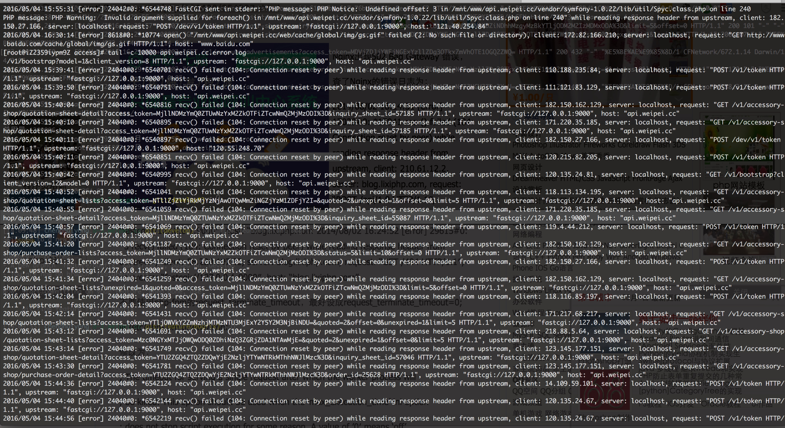

# 运维
---

[服务器TIME_WAIT和CLOSE_WAIT详解和解决办法]http://www.cnblogs.com/sunxucool/p/3449068.html

[解决 recv() failed (104: Connection reset by peer) while reading response header from upstream](http://www.th7.cn/Program/php/201408/254237.shtml)

[服务器TIME_WAIT和CLOSE_WAIT区别及解决方案](http://itindex.net/detail/50213-%E6%9C%8D%E5%8A%A1%E5%99%A8-time_wait-close_wait)
[[Nginx笔记]关于线上环境CLOSE_WAIT和TIME_WAIT过高](http://www.cnblogs.com/Bozh/p/3752476.html)
